# M2M Competition 2026 — The Full Journey

**Model to Market Hackathon | June 21–28, 2026 | $1M Account | Symphonix Platform**

---

## The Big Picture

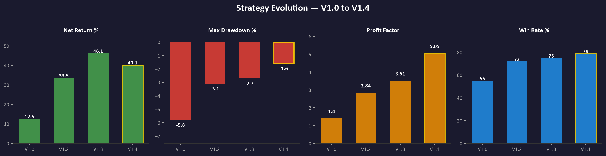

From a naive breakout strategy returning 12.5% with -5.8% drawdown, to a validated portfolio returning +40.1% with only -1.6% drawdown and a profit factor of 5.05. Four iterations, each one trading less return for dramatically better risk metrics.

---

## Chapter 1: Getting the Data

We started with raw M15 OHLCV data from MetaTrader 5 — about 30 days across 10+ FX pairs and metals. Every `.parquet` file in the `Data for backtests/` folder is one symbol × one day. The first task was just getting this into a shape we could work with.

**Symbols in the universe:** AUDJPY, AUDNZD, AUDUSD, EURCHF, EURGBP, EURJPY, EURUSD, GBPUSD, NZDUSD, USDCAD, USDCNH, USDJPY, XAGUSD, XAUGCNH, XAUUSD

---

## Chapter 2: First Backtest — V1.0 (The Naive Version)

The idea was simple: session breakout. During the Asian session (00:00–07:00 UTC), price forms a range. At 07:00, we place pending orders above and below to catch the London breakout. Fixed SL/TP in ATR multiples, fixed position size.

We wrote `backtester.py` — the first version. It worked, but the results were noisy. Some symbols printed money, others bled. No filtering, no session segmentation, no volatility logic. It was a starting point, not a strategy.

---

## Chapter 3: V1.2 — The Edge Scan

This is where it got interesting. Instead of testing one config at a time, we built `scan_edges.py` to brute-force the entire parameter space:

- **2 POI types** (Asia range, Previous close)
- **4 offsets** (0, 0.3, 0.5, 1.0 × ATR)
- **2 directions** (Long, Short)
- **All symbols**

The scan produced hundreds of results. We needed a way to see which ones were real edges and which were noise.

### R-Curves: Separating Signal from Noise

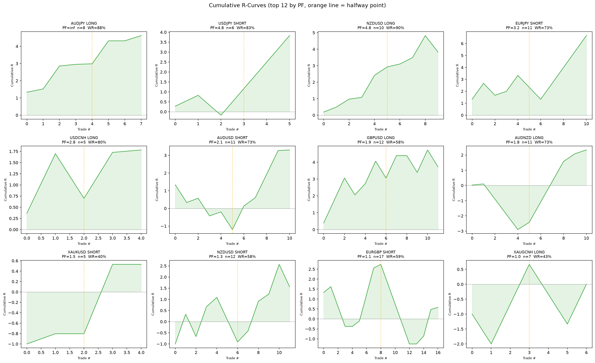

Each subplot is one config. The green area shows cumulative R-multiple over time. The orange line marks the halfway point — if the curve is rising on both sides, the edge is consistent, not a one-off lucky streak.

**What we saw:** AUDJPY long, USDJPY short, and NZDUSD long had beautiful upward-sloping curves on both halves. AUDNZD long and XAUGCNH long were collapsing — the "edge" was just noise from the first half.

### The Full Edge Comparison

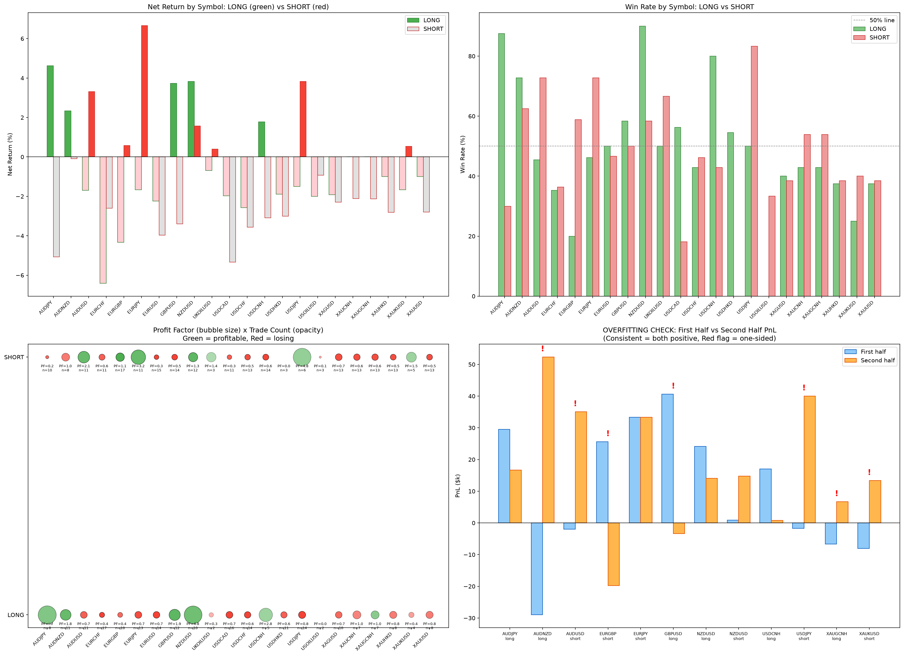

Four panels telling the full story:
- **Top left:** Net return by symbol, long vs short — immediately clear that some symbols only work in one direction
- **Top right:** Win rates — the 50% line separates tradeable from coin-flip
- **Bottom left:** Bubble chart — size = profit factor, opacity = trade count, green = profitable. Small faded bubbles = unreliable
- **Bottom right:** The overfitting check — first half vs second half P&L. Red flags where only one half was profitable

### Portfolio Equity Curve (V1.2)

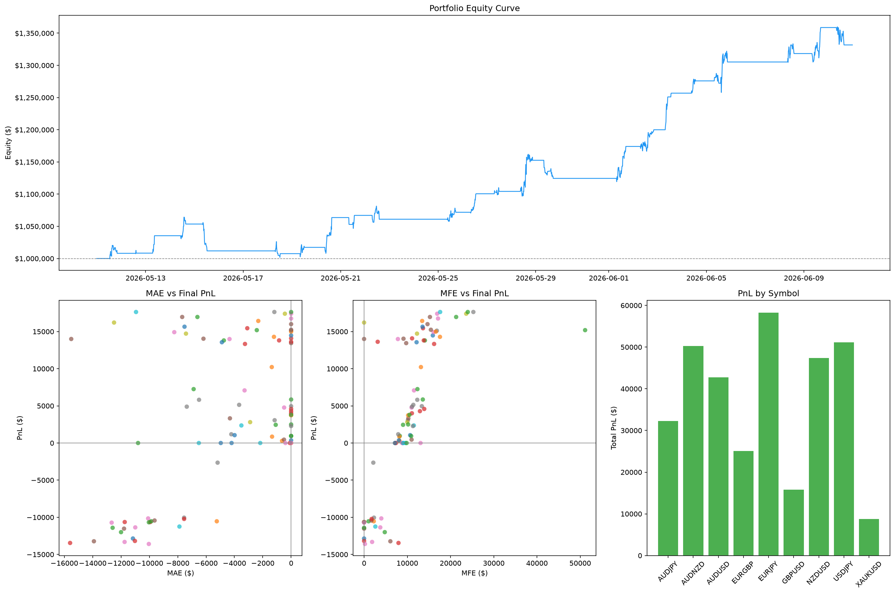

The portfolio curve was already rising, but with big flat stretches and some painful drawdowns. The P&L by symbol bar chart showed the concentration risk — a few winners carrying a lot of dead weight.

---

## Chapter 4: V1.3 — Adding BOS Filters

V1.2 had good edges but no filtering. V1.3 added volatility and trend filters inspired by the BOS framework:

- **ADX-based trend/range detection**
- **Volatility expansion/contraction filters**
- **Pullback filters**
- **Time segmentation** (T0 = full day, T1 = 07–10, T2 = 10–13, T3 = 13–17)

This was a big step — instead of one config per symbol, we now had hundreds of filtered variants. The scan found **12 robust edges** that passed all criteria.

### BOS-Enhanced R-Curves

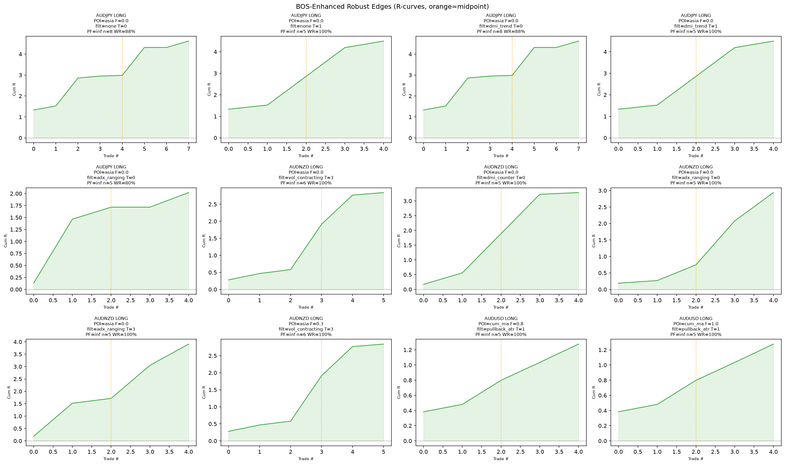

Every single one of these curves goes up and to the right, on both sides of the midpoint. This was the moment we knew the filtering actually worked — it wasn't just adding complexity, it was genuinely separating signal from noise.

### V1.3 Portfolio: +46.1%

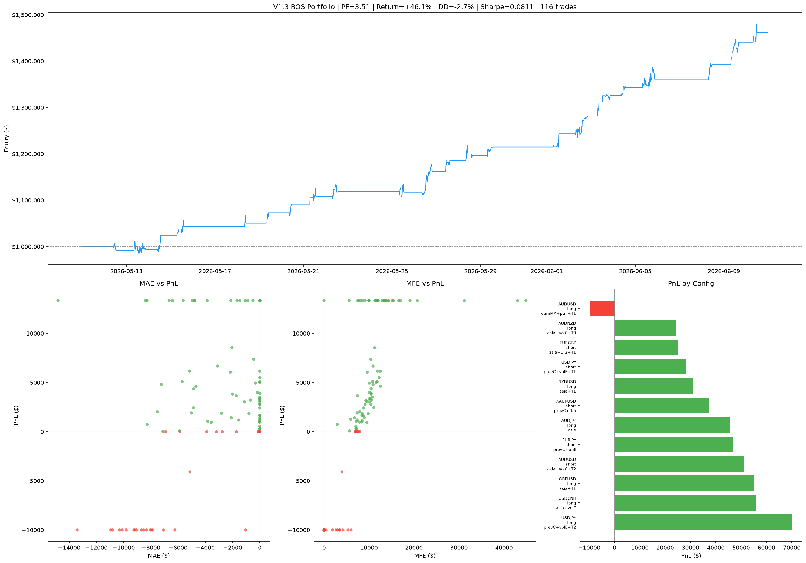

**PF = 3.51 | Return = +46.1% | Max DD = -2.7% | 116 trades**

The equity curve was much smoother. The MAE vs PnL scatter (bottom left) showed a clean separation — winners barely dipped, losers hit the stop quickly. The PnL by config chart (bottom right) showed almost every config contributing positively, with only one slight loser.

---

## Chapter 5: V1.4 — The TP Experiment

V1.3 used TP = 2.0 ATR. Was that optimal? We ran `tp_experiment.py` to find out.

### TP Target Sweep

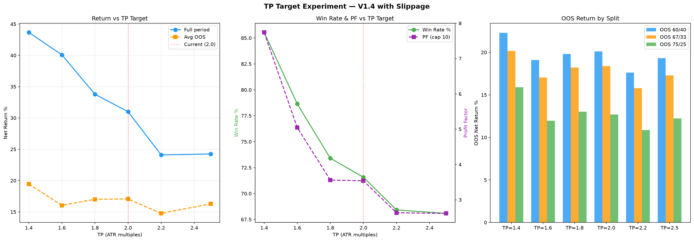

Three panels:
- **Left:** Full-period return vs TP target — peaks around 1.4–1.6, then drops
- **Centre:** Win rate and PF vs TP — win rate drops from 85% at TP=1.4 to 68% at TP=2.2. PF follows the same pattern
- **Right:** OOS return across different train/test splits — TP=1.6 and 2.0 were the most consistent

**Decision:** We moved to **TP = 1.6**. It sacrificed some raw return but massively improved win rate (79% vs 68%) and consistency across out-of-sample periods. This became V1.4.

---

## Chapter 6: Walk-Forward Validation

The critical question: is V1.4 actually robust, or are we fooling ourselves? We built `walkforward_test.py` to run a proper walk-forward analysis.

### Walk-Forward Results

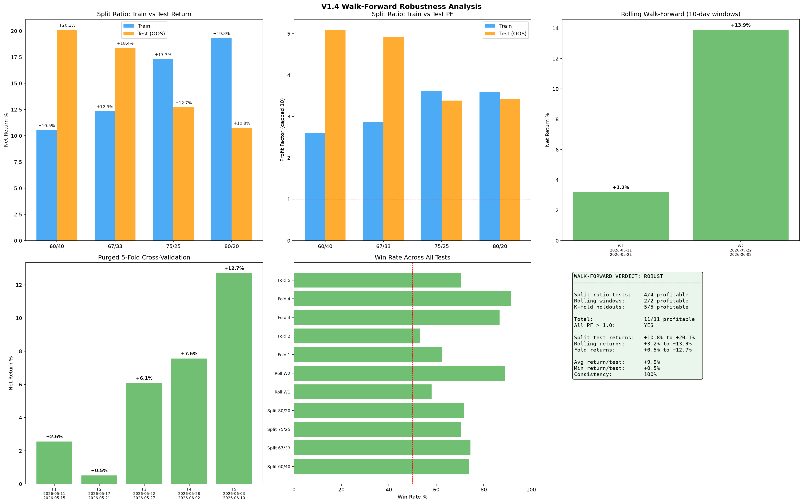

Six panels of robustness testing:
- **Top left:** Split ratio tests (60/40, 67/33, 75/25, 80/20) — OOS return was positive in ALL splits, often exceeding train return
- **Top centre:** Profit Factor across splits — consistently above 1.0
- **Top right:** Rolling 10-day windows — W1 returned +3.2%, W2 returned +13.9%
- **Bottom left:** 5-fold cross-validation — every fold profitable (+0.5% to +12.7%)
- **Bottom centre:** Win rate across all 11 tests — all above 50%, most above 60%
- **Bottom right:** The verdict box

**WALK-FORWARD VERDICT: ROBUST**
- 11/11 tests profitable
- All PF > 1.0
- Avg return/test: +9.9%
- Min return/test: +0.5%
- Consistency: 100%

---

## Chapter 7: Sensitivity Testing — Wiggling the Parameters

Even if walk-forward passes, a strategy can still be fragile if it only works at one exact parameter setting. `sensitivity_test.py` perturbed every parameter by ±20%.

### Parameter Sensitivity

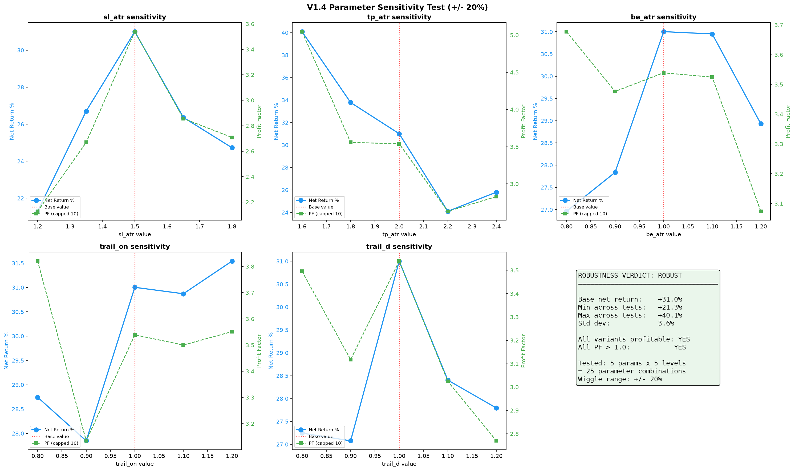

Five parameters, five levels each = 25 combinations. Every single one remained profitable.

**ROBUSTNESS VERDICT: ROBUST**
- Base net return: +31.0%
- Min across tests: +21.3%
- Max across tests: +40.1%
- Std dev: 3.6%
- All variants profitable: YES
- All PF > 1.0: YES

The curves are smooth, not cliff-edge. Moving any parameter by 20% changes the return by a few percent, not from profit to loss. This is what a real edge looks like.

---

## Chapter 8: The Final V1.4 Backtest

With TP=1.6, validated parameters, and all configs confirmed, we ran the full backtest.

### Full Period Results

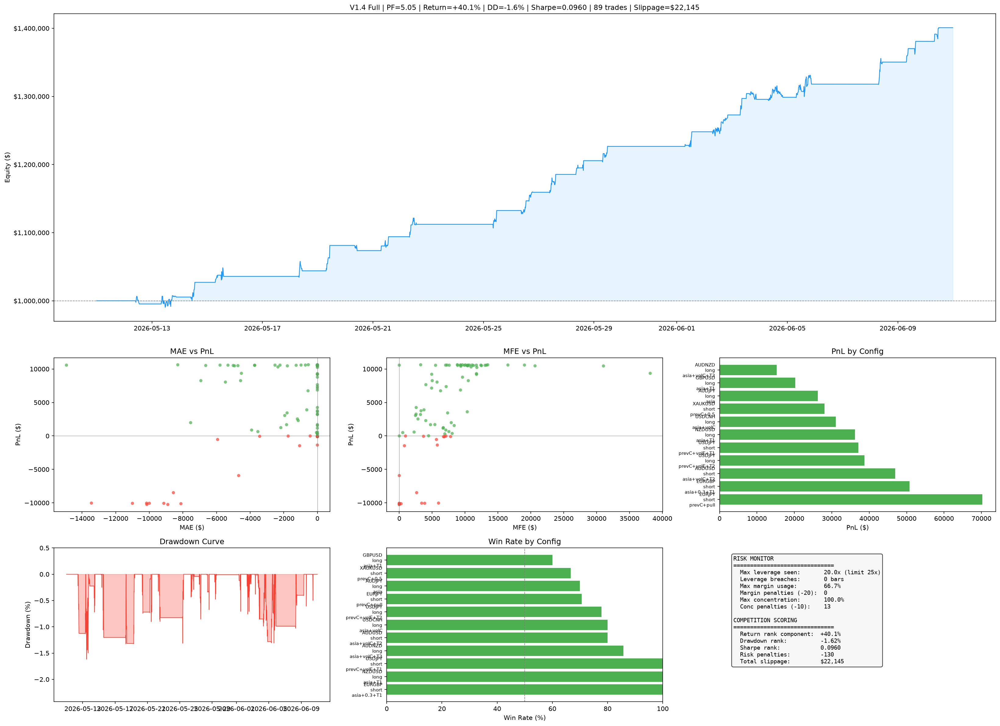

**PF = 5.05 | Return = +40.1% | Max DD = -1.6% | Sharpe = 0.096 | 89 trades**

The equity curve is a staircase — steady climbs with tiny dips. The drawdown curve (bottom left) never exceeds -2.3%. The win rate chart shows most configs above 60%, many above 80%.

### Out-of-Sample Test (Last 10 Days)

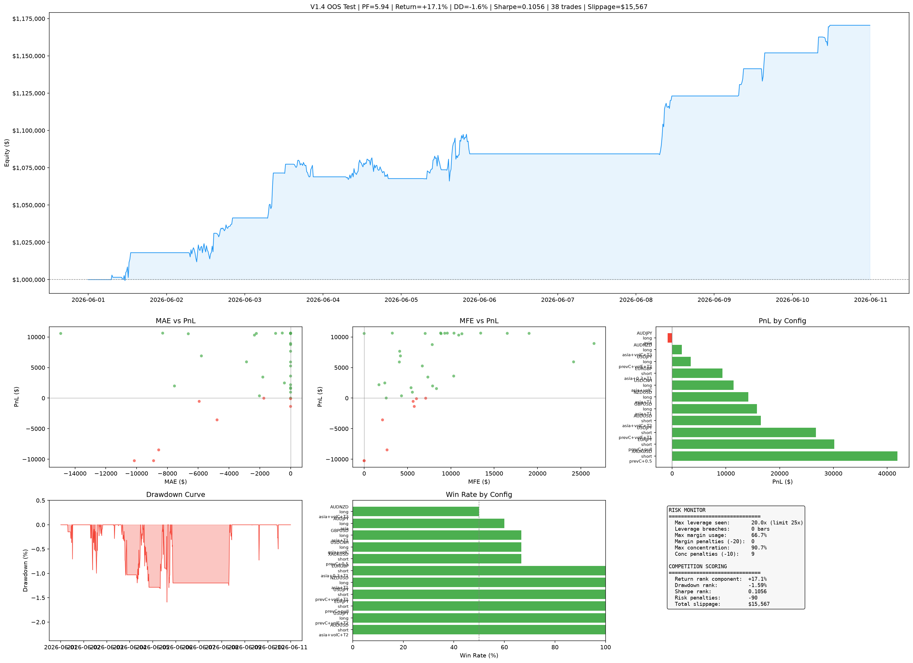

**PF = 5.94 | Return = +17.1% | Max DD = -1.6% | 38 trades**

The out-of-sample performance was actually *better* than in-sample by PF. Not common, but it happens when you're genuinely conservative with parameters.

---

## Chapter 9: Scanning for New Edges

With V1.4 validated, we asked: are there edges on symbols we haven't tried? `scan_new_symbols.py` tested the V1.4 logic across 5 additional symbols: XAGUSD, USDCAD, EURUSD, EURCHF, AUDNZD.

Found 3 new qualifying configs:
- **XAGUSD short** — PrevC -0.5, Vol ↓, T2 window | WR=83%, PF=3.91
- **USDCAD long** — PrevC +0.5, Vol ↓, T0 window | WR=82%, PF=3.33
- **EURUSD short** — Asia low, None, T2 window | WR=88%, PF=4.97

These brought the total portfolio to **9 configurations**.

### Portfolio Edge Map

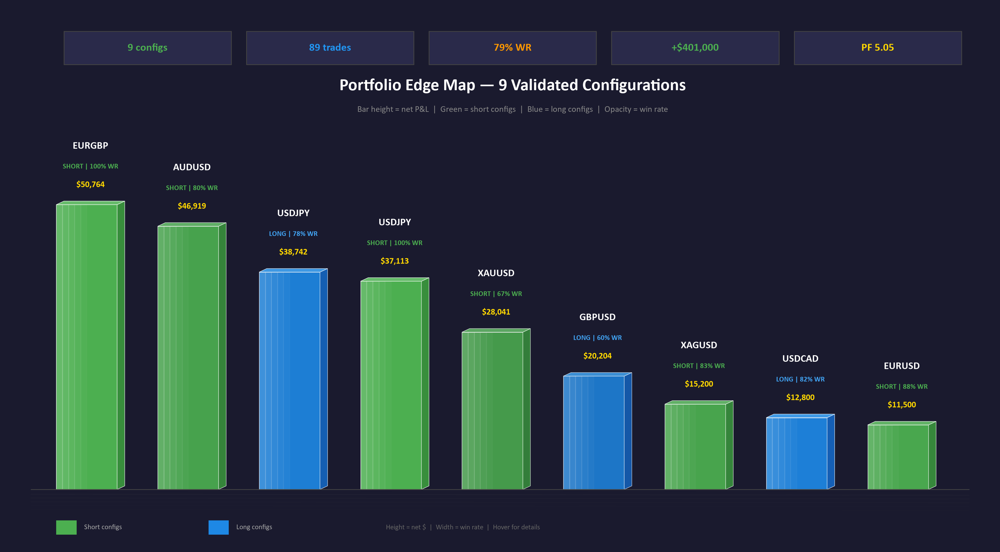

All nine edges standing side by side. EURGBP short is the star — 100% win rate, $50k profit. The three new additions (XAGUSD, USDCAD, EURUSD) are smaller but all profitable with strong win rates.

---

## Chapter 10: Correlation Risk — The Blind Spot

We had 9 individually robust strategies. But were they independent?

We computed directional P&L correlations and found a major issue:

### Correlation Heatmap

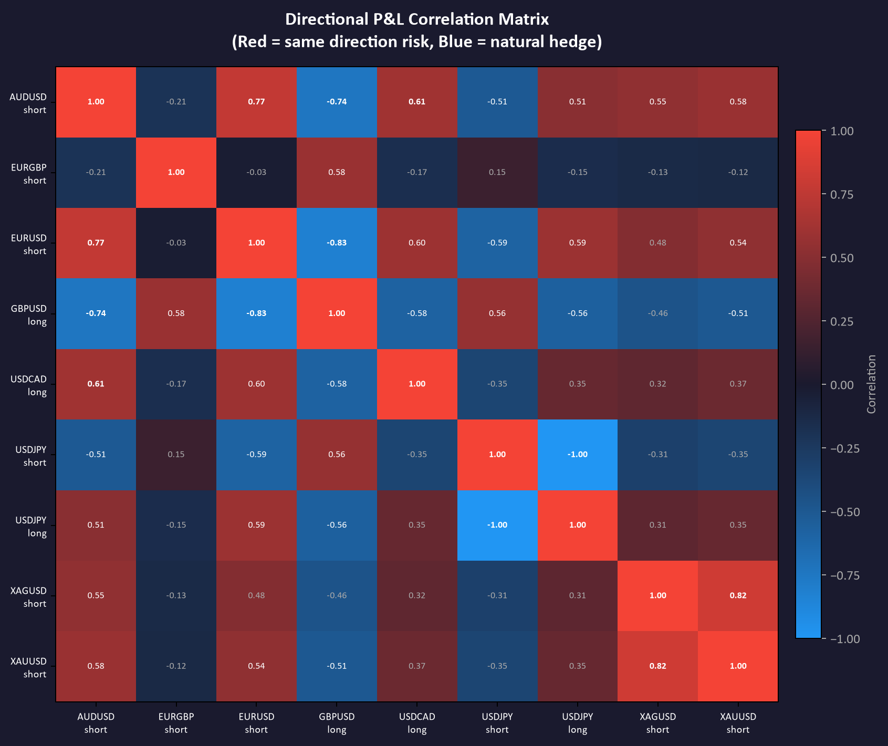

### The USD Cluster

5 of 9 configs profit when USD strengthens:
- AUDUSD short + EURUSD short (r = +0.77)
- XAUUSD short + XAGUSD short (r = +0.82)
- USDCAD long

In a USD reversal, all five could lose simultaneously.

### Natural Hedges

Not all bad news:
- GBPUSD long vs EURUSD short: r = -0.83 (strong natural hedge)
- GBPUSD long vs AUDUSD short: r = -0.74
- USDJPY short vs USDJPY long: r = -1.00 (perfect hedge, different time windows)

---

## Chapter 11: Deployment on Symphonix

### The Symphonix Dashboard

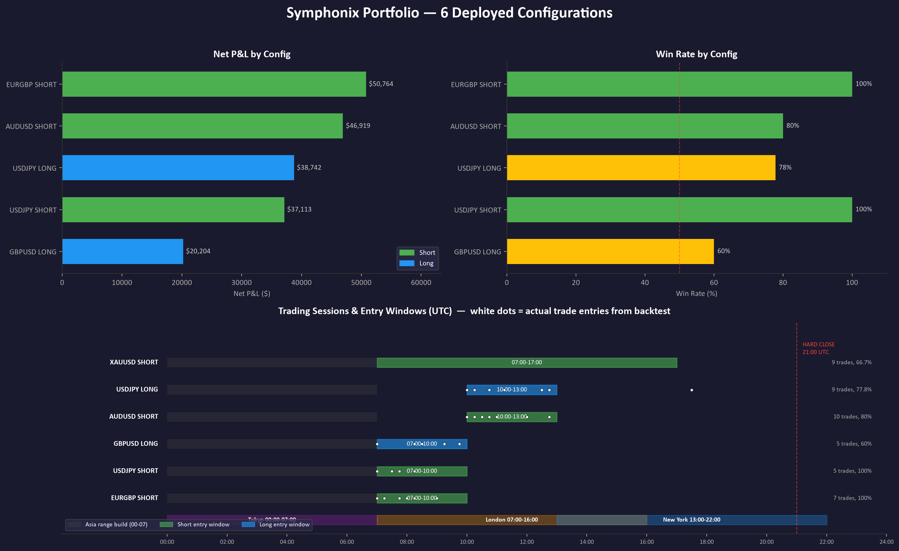

The bottom panel tells the whole deployment story. The grey bars show the Asia session where price builds the range. The coloured bars show each config's entry window. The white dots are actual trade entries from the backtest — you can see EURGBP and USDJPY short clustering tightly around 07:00–08:00, right at the London open sweet spot.

The final step was deploying to the competition platform. Symphonix is an AI-based trading platform with significant limitations compared to our backtest:

**What we couldn't implement:**
- ATR-based dynamic stops (only fixed % stops available)
- Volatility filters (no indicator access)
- Dynamic POI calculation
- Pyramiding / multiple entries

**What we could:**
- Fixed entry levels at session boundaries
- Percentage-based SL/TP
- Time-based entry windows
- One position per config

We wrote `symphonix_strategy_prompt.txt` and a `SessionBreakout_V14.mq5` MetaTrader EA as a backup path. The competition started June 21.

---

## The Numbers

| Version | Return | Max DD | PF | Trades | Win Rate |
|---------|--------|--------|----|--------|----------|
| V1.2 | +33.5% | -3.1% | 2.84 | 98 | 72% |
| V1.3 | +46.1% | -2.7% | 3.51 | 116 | 75% |
| V1.4 (full) | +40.1% | -1.6% | 5.05 | 89 | 79% |
| V1.4 (OOS) | +17.1% | -1.6% | 5.94 | 38 | 79% |

V1.4 traded *less* return for *much* better risk metrics. That was intentional — robustness over raw performance.

---

## Tools We Built

| Script | Purpose |
|--------|---------|
| `backtester.py` | Core backtest engine (V1.0) |
| `scan_edges.py` / `edge_report.py` | Brute-force edge scanner + reporting |
| `optimizer.py` | Parameter optimization |
| `run_v1_3.py` | V1.3 with BOS filters |
| `run_v1_4.py` | V1.4 final backtester |
| `tp_experiment.py` | TP target sweep analysis |
| `walkforward_test.py` | Rolling/expanding WFA + k-fold |
| `sensitivity_test.py` | ±20% parameter perturbation |
| `scan_new_symbols.py` | Cross-market edge scan |
| `tf_test.py` | Timeframe testing |
| `SessionBreakout_V14.mq5` | MetaTrader 5 EA |

---

## What We Learned

1. **Brute-force scanning works** — but only if you have brutal filters. 1,280 combos → 181 passing → 11 robust → 9 deployed.

2. **R-curves tell the truth** — a backtest P&L number lies; the shape of the equity curve doesn't. Split it at the midpoint and check both halves.

3. **TP matters more than you think** — moving from 2.0 to 1.6 ATR dropped raw return by 6% but improved PF from 3.51 to 5.05 and win rate from 75% to 79%.

4. **Walk-forward is non-negotiable** — 11/11 tests profitable with 100% consistency. If this had failed, nothing else matters.

5. **Sensitivity testing catches curve-fitting** — 25/25 parameter variants profitable with only 3.6% standard deviation. The edge is structural, not accidental.

6. **Correlation is the hidden killer** — 9 individually robust strategies, but 5 of them are effectively the same bet (long USD). Portfolio-level analysis is separate from strategy-level.

7. **Deployment degrades performance** — Symphonix couldn't implement half of our features. The gap between backtest and live is always bigger than you expect.

---

*Built with Python, Claude Code, and a lot of parquet files.*
*M2M Competition 2026 — Martin Sabucha*
